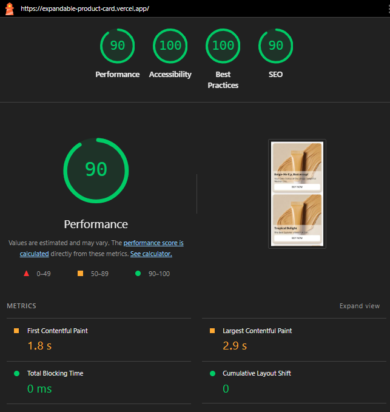

## The Challenge

Build an expandable product card that demonstrates pixel-perfect UI implementation and smooth animations for use on mobile.

1. Create a product card that expands into a detailed view when clicked

2. Implement smooth animations using Web Animations API, or pure CSS animations

3. Submit your solution as a detailed PR

## Design Assets

https://www.figma.com/design/8xB9L3WA0ls2dQlpYIk7no/Untitled?node-id=0-1&t=YFFpC5CSXE8dAwtZ-1

## Submission

https://expandable-product-card-ui.vercel.app/

## Technical Requirements

- [x] React + TypeScript
- [x] Raw CSS only - demonstrate your CSS expertise through:
  - Custom CSS properties (variables)
  - Modern CSS layout (Grid/Flexbox)
  - CSS transforms for animations
  - Media queries for responsiveness
- [x] No CSS frameworks or utilities (no Tailwind, Bootstrap, etc.)
- [x] No CSS-in-JS libraries
- [x] No animation frameworks (use ~~Web Animations API or~~ CSS animations)

## Steps to run locally

- Make sure you have Node.js (preferably version >=20.0.0) and npm working locally
- Install the dependencies using `npm ci`
- Run the command `npm run dev`

## Implementation details

- React Router is used to manage the app's routing.
- The first page is the Product List, which uses simulated hardcoded data from the product-api.ts file. - A delay of 1 second is added using the setTimeout function to mimic a real API call.
- A Skeleton UI is displayed while the product list is loading.
- Clicking on a product navigates to the Product Detail page using routing.
- Keyframe animations are applied for smooth transitions when loading the product list and displaying the product detail page.
- A Close (cross) button on the product detail page navigates the user back to the product list page.
- Both the Product List and Product Detail are implemented as separate components, each with its own corresponding CSS file for styling.

## Animation implementation details

- Custom Skeleton UI before loading the product list.
- CSS Keyframe FadeInUp animation for smooth loading of the product list.
- CSS Keyframe ScaleInVertical animation for smooth expansion of the product detail card.

  ## Performance metrics from lighthouse

  
